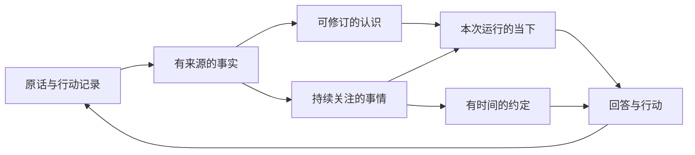

# ADR 0004 个人记忆的证据与行动模型

Acorn 的记忆围绕持续相处设计：保留发生过的事，形成有依据且可以修正的认识，在合适的时候想起有关信息，并把未完成的关切与实际行动联系起来。记忆引擎由 Acorn 自行实现，吸收 Hindsight 的结构化抽取、混合检索和证据整合设计。

本决策覆盖记忆的数据模型、读写流程、上下文装配、夜间反思、工具、迁移和验收。它更新 ADR 0003 中的记忆决策；仓库现状与测试约束见 `AGENTS.md` 和 `docs/architecture/INVARIANTS.md`。

## 产品目标

记忆带来四种可感知的行为。

1. **记得事情的来龙去脉。** 换线程或换一种问法后，能够找到以前的决定、当时的理由与后来发生的变化，并展开原话或行动记录。
2. **对人的认识会被修正。** 明确表达的偏好长期保留；推测带着依据与不确定性。用户更正后，后续回答使用新的认识，询问过去时仍能说明当时的状态。
3. **知道什么仍未完成。** 一项关切可以关联多次对话、几次行动与一个约定。重新遇到相关话题时，agent 能接着推进，也知道什么已经完成或被放下。
4. **从行动结果中学习。** agent 能区分自己提出过什么、尝试过什么、工具报告了什么，以及 owner 是否认可结果。后续建议会使用有结果支持的经验。

这些行为构成 Acorn 的特色：记忆参与日常陪伴、主动唤醒与行动反馈。persona 表达 owner 设定的人格，记忆记录相处中形成的认识，两者各有归属。

## 上下文整合

原始消息与行动先持久化，再进入有来源的记忆处理。运行前按 token 预算装配线程摘要、近期原文与相关记忆；夜思回顾改变的证据、未完成关切及约定执行结果。自动记录、同步更正、遗忘和行动反馈共用来源与修订契约。

## 记忆对象与归属

| 对象 | 含义与例子 | 真相归属 |
|---|---|---|
| 来源 source | 用户的一条消息、一次工具结果、一个笔记版本、一次追踪事件 | 原始记录及其稳定引用 |
| 经历 episode | 某次对话或行动的经过，如排查部署故障并得到结果 | 以 run 聚合来源和事件，摘要是可重建的视图 |
| 事实 fact | “owner 明确说不吃香菜”“本次推送请求已被 FCM 接收” | 记忆记录与具体来源；保留事实适用的范围 |
| 认识 insight | “owner 在日常用餐时倾向清淡口味”“某类排查应先检查实际入口” | 由事实支持的版本化认识 |
| 念头 thought | agent 的一个猜想、问题或待验证解释 | 明确标记为 agent 的思考，并关联启发它的来源 |
| 关切 concern | “完成 Go 面试准备”“处理反复失败的部署” | 有状态的持续事项，关联事实、念头、经历和约定 |
| 约定 commitment | 在确定时刻醒来做一件事 | 调度状态及执行记录 |

来源保存说话者、来源类型和观察时间。文章内容属于外部陈述，assistant 的建议属于建议，工具结果只能支持工具实际报告的范围。一次 HTTP 成功只能证明该请求成功；用户是否完成目标，需要相应结果或明确反馈。

知识库继续以 Markdown 文件为真相。记忆可以引用路径和 Git 版本，提取与 owner 有关的事实；阅读文章全文仍由知识库承担。persona、技能正文、模型内部推理块和上下文快照各自保留现有职责，记忆摄取范围以本提案的来源规则为准。

## 有效性与注意力

事实和认识的有效性，使用 `current`、`disputed`、`superseded`、`retracted` 表达。适用时间由 `valid_from`、`valid_to` 表达，系统获知时间由 `recorded_at` 表达；无法确定的时间留空。过去时间的查询按适用时间和修订关系解释，无法重建的细节明确保留未知。

注意力决定信息是否进入本次“当下”。它综合当前任务相关性、owner 最近的明确关注、关联事项是否未完成、已知复查时间和 owner 的固定要求。时间衰减作用于注意力；事实的有效性由证据、明确更正和适用期限控制。

稳定偏好可以保持 `current` 多年，在相关问题出现时被检索。临时状态如“本周出差”带有效区间，期满后作为历史经历保留。主动注入、重复检索、agent 自己复述同一认识，都不增加独立证据数量；owner 再次明确确认或新的独立观察才能增加支持。

关切使用 `active`、`waiting`、`resolved`、`released`；念头使用 `open`、`resolved`、`released`。每次状态变化保留原因和来源。约定使用 `scheduled`、`due`、`completed`、`cancelled`，周期约定按每次发生记录认领和结果。记忆整合可以提出待检查事项，调度状态由约定服务和执行结果维护。

## 证据与修订

每个 fact 至少关联一个来源及可核对的原文片段。每个 insight 至少关联一个事实，关系可以是支持或反驳。念头可以只有启发来源，展示时保留其推测性质。引用必须通过来源 ID、版本和片段校验；引用存在并不能自动证明推论成立，语义支持仍需评测。

来源强度按问题判断。owner 对自己的偏好具有直接解释权；外部世界的事实需要相应来源；assistant 的推断保持推断。直接证据标记为 `direct`，认识和念头标记为 `inferred`，尚待核对的导入记录标记为 `unverified`。模型输出的任意数值不作为置信度事实。

明确更正形成修订关系。例如先说“不吃香菜”，后来说明“现在可以接受少量”：新偏好从明确的生效时间起适用，旧偏好有对应的结束时间，修订记录关联两次原话。仅仅新增一条相似事实，不能自动覆盖旧记录；时间、对象或情境不同的事实可以同时成立。证据冲突且无法消解时，两者组成 `disputed` 集合，当前召回同时给出冲突和依据。

新的直接证据进入后，受影响的 insight 标记为待重算。召回返回直接证据和该状态，完成整合后再提供修订后的认识。owner 的明确更正通过同步工具事务立即生效，agent 只有在工具成功后才能确认已更新。

数据库用 revision 做条件更新，批量修订及修订前后的版本在同一事务中提交。并行 run 与夜思提交冲突时，重新读取相关记录后重新判断；已失效的模型输出不会覆盖更新后的状态。关系写入检查循环与自引用，独立证据按根来源去重。`as_of` 表达当时适用的认识，`known_at` 表达截至某时系统已经获知的内容，分别用有效区间与版本记录回答。

## 自动记录与持久化处理

原始对话和行动先保存，再由后台处理提取长期记忆。消息、可用的工具结果与对应待处理项在同一数据库事务中登记；每个处理项以 `(source_id, source_revision, operation, processor_version)` 唯一标识。进程重启后继续处理，失败保留错误与重试状态。知识文件在 Git 提交后登记版本，扫描游标以 commit 为单位补齐尚未登记的修改，同一版本只登记一次；文件与 SQLite 的提交边界分别记录。

来源边界如下。

| 来源 | 摄取规则 |
|---|---|
| owner 消息 | 保留原话引用，抽取明确事实、偏好、决定及关切；请求和愿望按其语义分类 |
| assistant 公开回复 | 用于还原经历及建议；关于 owner 或外部世界的结论必须回到独立来源建立支持 |
| 工具调用与结果 | 只摄取有公开结构化结果或可引用正文的调用；状态、参数及结果版本一并保留 |
| agent 显式念头 | 由 `think` 保存为 thought，后续可验证、修正或放下 |
| knowledge 与 capture | 引用笔记路径、提交及相关段落；附件通过已有笔记内容或明确描述关联 |
| watch 与手机通知 | watch 变化是有来源的外部信号；手机通知默认只参与短期感知，转成长记忆需明确相关性与来源依据 |

处理依次为：读取有角色和时间的来源片段、结构化抽取、校验引用、融合语义候选、实体邻居与关键词候选、提交事实和关系、生成向量、登记受影响的认识。抽取可以产生零条长期事实，处理项仍记录已完成及原因。时间归一化使用来源时间与 owner 时区；存在多种合理解释时保留不确定性。

对长来源按完整消息或段落分块，记录边界和邻接引用。抽取批次限制输入 token 和输出条目数，超限产生下一批处理项。模型调用期间不持有 SQLite 事务。首次实现使用一个持久化消费者，事务认领带租约和递增认领 token；每次任务有独立取消、有限重试和错误记录。

提交产物时同时校验认领 token、来源 revision、目标 revision 和当前排除版本，将结果、后续处理项与本次任务完成状态一并提交。租约已被重新认领或来源已被遗忘的任务无法提交。显式 `keep` 和自动抽取共享同一个来源键，抽取补充证据时复用已存在的记录。抽取和整合使用有界的结构化模型调用，每个 run 继续由一个 ChatModelAgent 执行。

日常抽取只处理增量。夜间整合按最近改变的实体、事实和关切选择批次，随后更新进度游标。重复处理同一来源、重复生成同一关系以及重启后的任务重放，都必须幂等。

## 检索与上下文

### 召回流程

一次召回先明确查询、实体、当前或历史模式、时间范围及 token 预算，然后执行四路候选获取。

1. **语义检索**使用 embedding 找同义表达与相近含义。
2. **关键词检索**使用 FTS5 处理名称、术语和原话，并通过分词后的独立查询避免把整句固定为一个短语；短中文词使用明确的短词检索路径。匹配超过 4,096 条记录的词区分度低，不参与关键词排名，由语义检索覆盖。
3. **关系扩展**沿实体名称与记录关系找相关事实和认识，限制深度和候选数量。来源明确声明的规范名、别名与适用范围保存为带 revision 的别名关系；查询只在身份唯一或给出可区分范围时展开规范名。引用必须逐字存在于支持证据，历史时间和来源排除条件同样约束别名使用。
4. **时间检索**按事件发生时间和有效区间找候选，系统记录时间用于解释“何时得知”。

候选先按有效时间、当前状态、线程和实体条件过滤，再以 RRF 合并；同分时按记录 ID 确定顺序。自动注入使用 `standard` 深度；`deep` 深度扩大关系候选，并增加一次有界的模型重排，模型只返回有序候选 ID。最终按 token 预算装配，保留来源、当前状态、适用时间和冲突标记。任何一条召回结果都可展开到原话、相关事实与修订链。

`current` 模式返回当前可用的事实、认识和相关未完成事项；历史模式可以查看已替代、撤回和已结束的记录，并显示它们当时的状态。查询条件和候选过滤由代码执行，重排无法把已排除的记录重新加入。

### 存储与向量

首版保持 Go 与 SQLite 的自托管形态。FTS5 保存词法索引，实体和关系存关系表，向量以带模型版本与维度的规范化 float32 数据保存在 SQLite；每个可见 revision 的向量同时建立带独立比例系数的 int8 候选索引。`known_at` 在向量排名前选择当时可见的 revision；重建覆盖全部可见历史版本，来源遗忘同时移除受影响版本的向量。检索在 Go 内每批扫描至多 512 条候选编码，保留 2048 个候选，再读取 float32 原向量计算精确余弦，取得 160 个语义候选。批次、向量内存和数据库读取时长都有边界，循环检查 context 取消。

embedding 使用独立的外部模型配置，抽取、整合和深度重排复用当前主模型的协议及超时机制。查询模型与活动索引的模型、维度必须一致。变更 embedding 配置时，停止 serve，通过显式重建命令按游标生成新 generation；完成数量、维度、记录 revision 和排除规则校验后原子切换，删除旧 generation，再恢复 serve。重建失败可继续同一 generation；尚未完成时启动检查明确报告索引状态。

10,000 与 100,000 条记录构成实施阶段的性能基准。分别报告关键词、向量扫描、关系扩展、外部 embedding、深度重排与总耗时，以及峰值内存、SQLite 等待和取消耗时。初始验收目标是在目标服务器 100,000 条、1,024 维的测试集上，本地 standard 检索 p95 小于 2 秒、单次检索额外内存小于 64 MiB，扫描分批释放数据库连接；一个摄取 worker 并发运行时检索 p95 同样小于 2 秒；外部服务延迟单列。这些数值是设计目标，索引策略以目标服务器实测和候选重排质量共同验收。

### 新一轮运行

运行前由上下文装配器取得最新消息、有关记忆和当前事项，传给唯一的 ChatModelAgent。上下文由四部分组成：稳定人格与规则、线程摘要和近期原文、本次问题相关的长期记忆、当下的约定与关切。

线程历史按 token 预算加载完整消息，始终包含当前输入和必要的相邻上下文。较早内容通过带 `through_message_id` 与来源范围的增量摘要承接。摘要只表示该线程的对话进展，事实记忆仍带自己的证据。摘要引用覆盖的原文区间，并可按需展开；生成失败保留明确错误及未处理游标。

普通自动召回每个新 run 做一次，查询由当前输入和唤醒原因形成，结果保存在该 run 的显式上下文对象中。自动查询有独立的长度上限；历史时间与实体条件由主 agent 结合线程上下文调用 `recall` 时显式给出。presence 在后续模型调用中刷新当前约定、关切及本 run 产生的记忆变更；agent 需要深入回忆时调用 `recall` 和 `memory_read`。引用有效性在每次注入前核验，修订或遗忘后的记录从后续注入移除。

记忆抽取异步，因此每份上下文带待处理来源数量、任务数量、选中的原始来源和可用索引 generation。近期原文覆盖当前对话中尚未抽取的内容。跨线程或精确历史问题同时检查查询范围内尚未处理的来源，按时间、线程和原文关键词选择有界的原始片段；其身份是尚未整理的证据。尚未生成向量的来源不具备完整语义检索覆盖，结果明确给出该范围。查询失败显式返回错误，完整性不足时结果标记其范围。

上下文预算由模型输入预算统一分配。令 `B = window_tokens - output_reserve - compact_margin_tokens`，完整输入中的 Instruction、工具 schema、线程内容、记忆、presence 与本次 run 状态合计受 B 约束。优先保证当前输入、正在履行的约定和必要恢复状态，剩余部分在历史与记忆上限内分配；Eino 的压缩阈值扣除由 wrapper 单独注入的实际预留，避免重复占用。必需内容超过预算时给出可定位错误。快照正文保留召回记录及其 revision、摘要与原文，引用表记录 source/record ID 和排除版本，便于复查当时为什么想起这些内容。

## 夜间反思与行动反馈

夜思执行有明确输入边界的三类整理：整合新增证据；检查被新证据影响的认识；回顾未完成的关切及有结果的行动。每批产物都是可核对的变更集，包含引用、关系、修订理由和旧 revision，经代码校验后提交。

例子：agent 曾建议“每晚推送面试复习题”，owner 后来明确要求只在工作日提醒。新的认识记录适用条件，相关关切关联这次反馈，后续排约定时读取该条件。owner 没有回复某条推送，只表示反馈未知；系统不据此推导喜欢或不喜欢。

游思从一个仍未解决且当前有推进条件的 concern 出发，查找已有尝试、结果和待验证问题，产出一个念头、具体进展或合适的下一次约定。长期目标本身保持可检索，主动唤醒遵守现有次数与 token 预算。

有益的行为经验以 insight 表达适用条件、依据和已观察结果，参与后续决策。persona 由 owner 编辑，技能保留现有只读发布流程。

## 工具与用户控制

| 工具 | 新契约 |
|---|---|
| `recall` | `query`、`mode=current/history`、`depth=standard/deep`、可选实体、时间范围、`as_of`、`known_at`、`max_tokens`；返回状态、依据、覆盖范围和展开 ID |
| `memory_read` | 展开记录、根来源原文、修订链和关联经历，按 token 预算分页 |
| `keep` | owner 明确要求记住时，引用当前原话并同步保存事实或偏好；返回实际持久化结果 |
| `think` | 保存带来源的 agent 念头，标明待验证的问题及关联关切 |
| `memory_correct` | 引用当前 owner 更正及目标 revision，提交修订和直接证据 |
| `memory_forget` | 接收已解析的目标 ID、范围和 owner 请求来源，提交检索排除及派生记忆清理 |
| `concern` | 创建、读取、推进、等待、解决或放下持续事项，变化带理由及来源 |
| `schedule_wake` | 创建关联 concern 的约定，保持现有时间和周期语义 |
| `settle` | 完成或取消约定；完成需要执行记录或 owner 确认的引用 |

普通对话自动摄取，`keep` 用于显式强调和需要立即生效的保存。纠正和遗忘工具要求当前 owner 请求的来源；含糊的目标先解析成可理解的范围，再请 owner 选择。后台整合的权限限定在证据支持的更新。

“忘记这件事”表示从 agent 的后续记忆与上下文使用中移除：目标记录、向量、相关派生认识失效；相应来源片段记入排除表，自动重放不会再次提取。聊天记录和知识库文件仍按各自的数据管理规则保留，工具返回中明确这一区别。用户明确要求删除原文时，进入相应数据删除流程。

排除必须覆盖近期历史装配、线程摘要、经历搜索、原文展开、返回给 agent 的知识片段与新的记忆处理。派生结果保存来源关系，清理时重算仍有其他独立依据的认识。assistant 复述、线程摘要与模型生成摘要保留其输入来源依赖，排除沿这些依赖传播。排除范围以现有记录、稳定来源对象和已知片段为准；owner 后来主动提供的新信息按新的来源处理。

模型输入中的消息、工具结果与摘要带有来源映射。新增的 memory visibility middleware 在 summarization 之前校验排除版本，移除失效原文及其派生摘要，并用无正文的状态结果替换受影响的 recall 工具结果，以维持工具协议配对。旧版本的在途模型生成被取消，取消完成后才能确认遗忘；后续模型调用从过滤后的状态继续。已发出的文本仍属于用户可见的历史，已启动的外部工具按其执行与取消契约收尾。checkpoint 保存和恢复都经过同一排除校验，操作任务提交也必须重新检查排除版本。

“为什么你认为我喜欢这个”直接使用证据展开回答。“这只是你猜的”可以撤回一条推断而保留其原始经历。“这个已经做完了”更新对应 concern 或 commitment，并保存确认来源。

## 数据与模块边界

SQLite 继续承载持久化真相。以下为主要逻辑表与关键约束；迁移和数据库约束固定字段类型、外键和唯一键。

| 表 | 关键内容与约束 |
|---|---|
| `memory_sources` | 稳定 source ID、原始对象类型与 ID、version、speaker、recorded_at、occurred_at、读取状态；同一原始对象版本唯一 |
| `memory_records` | 当前 revision 的 fact/insight/thought、正文、适用范围、有效状态、有效时间、来源标签、注意力属性；任何可用记录有可追溯来源 |
| `memory_revisions` | 每次修订的全部字段、系统时间与原因；支持 known_at、撤回与审计 |
| `memory_revision_evidence`、`memory_revision_entities`、`memory_revision_parents`、`memory_revision_sources` | 每个 revision 的支持/反驳证据及精确原文片段、实体、父记录与解析后的根来源；可见性与遗忘按 revision 判断 |
| `memory_links` | record 间的 derives_from、supersedes、contradicts、related_to；修订关系有明确方向 |
| `memory_entities` 与 `memory_mentions` | 实体名称与记录关联；实体条件按名称过滤，语义检索补充不同表达的候选 |
| `memory_concerns`、`memory_concern_revisions` 与 `memory_concern_records` | 事项的当前状态、理由、来源与复查时间；每次修订的全部字段及当时关联的记录；约定经 `concern_id` 关联事项 |
| `commitments` 与 `commitment_occurrences` | 约定规则及每次发生的认领、执行 run、结果；一次发生只认领成功一次 |
| `memory_embeddings` 与 `memory_vector_sketches` | record revision、维度、generation、float32 原向量及 int8 候选编码；历史版本和当前版本分别索引 |
| `memory_entity_aliases` | revision 对应的规范名、别名、范围及来源精确引用 |
| `memory_index_state` | 活动模型与维度、generation 和状态；重建进度保存在每条记录的 embedding job 中 |
| `memory_jobs` | 操作、来源版本、处理器版本、认领租约及 token、排除版本、状态、尝试数、错误和游标；幂等键唯一 |
| `memory_exclusions` | 排除目标、来源片段或对象、owner 请求引用和版本；摄取与所有读取路径共用 |
| `thread_summaries` 与 `thread_summary_sources` | 线程、覆盖到的 message ID、摘要和排除版本，以及摘要覆盖的来源；来源被遗忘时摘要随之删除，可重建 |
| `context_snapshot_refs` | 快照与 source/record ID 的引用关系和排除版本；支持解释及排除传播 |

原话和工具结果通过稳定引用读取已有记录，记忆证据存必要的片段定位。迁移中没有其他原始载体的条目，其正文进入明确标记的导入来源，作为该内容的保留位置。

`internal/memory` 拥有摄取、检索、证据整合、修订与上下文选择。`internal/presence` 继续承担确定性的当下渲染、人格读取和时间规则。`internal/wake` 拥有调度；`internal/runtime` 接入 run 的上下文与记忆工具，并提供现有模型协议上的结构化调用适配；`internal/store` 实现事务与索引存取。

core 定义记录、查询、变更集、处理状态及相应端口。wire 注入 store、模型、embedding、时钟和消费者。MemoryStore 与 CommitmentStore 接替当前 PresenceStore 中的相应职责，快照及用量归入其实际消费者的接口，测试同步约束新的接口清单与依赖方向。运行中服务对象由容器持有，查询缓存与选择结果有明确的 run 生命周期。

## 资源与失败语义

配置分成长期记忆处理、embedding 和上下文三个职责。抽取、整合和深度重排使用现有主模型，所有配置遵守 KnownFields 严格解析。新增字段同时进入 defaults、校验、示例和 installer。

| 配置 | 初始设计值与含义 |
|---|---|
| `memory.daily_tokens` | 100000；后台记忆调用的每日预算，0 表示不限 |
| `memory.batch_tokens` | 8192；一次抽取或整合的最大输入 token，按模型输入容量校验 |
| `memory.context_tokens` | 8192；一次自动召回的文本上限，在总预算内分配 |
| `memory.history_tokens` | 32768；近期原文及线程摘要的合计上限，在总预算内分配 |
| `memory.embedding.base_url` | 显式配置的 embedding API 地址 |
| `memory.embedding.api_key` | 支持环境变量展开的凭据 |
| `memory.embedding.model` | 显式选择的中文与多语种 embedding 模型 |
| `memory.embedding.dimensions` | 与模型实际返回一致的维度，索引配置及每批结果校验 |

embedding 采用 Eino embedding 契约，供应商为 Voyage，默认 `voyage-4`、1024 维；主模型沿用 Acorn 已配置的协议。历史和记忆字段是上限，模型输入容量较小时由预算分配器收缩可选内容。

每个模型和 embedding 调用记录唯一调用 ID、operation、source/job/run、provider、model、输入输出 token、是否由提供方报告以及重试成本。后台抽取、向量处理与整合归入记忆日预算；夜思和游思及其召回归入现有自主运行预算；owner 对话的召回计入该次 run 的用量。一次调用只有一个预算归属，总用量报告按调用 ID 汇总。未返回 usage 时记录估算值及其性质，预算检查保留该次输入与最大输出的预留。

预算耗尽时待处理项保留至下一周期。持久化失败不会确认保存成功；模型或 embedding 失败保留为可重试任务；召回中的外部调用失败明确返回该阶段错误。服务启动只做确定性 schema 迁移与消费者恢复，模型处理进度有独立 readiness 状态。`doctor` 显示排队数量、最旧待处理时间、失败任务、索引 generation、最近整合时间及记忆用量。

用户界面沿用对话和运行页，记忆更正、遗忘、来源解释先通过对话实现。需要显示记忆处理状态或新增 API 字段时，OpenAPI、生成客户端与测试一并更新；手机端新增的交互必须完成设备验收。

## 数据迁移与切换

迁移保留已有原话、经历、知识文件、设备和运行数据。新 schema 由一个确定性的数据库迁移建立；读取旧条目、写入新对象、核对数量与关系、记录版本和移除旧表，在受控事务中完成。启动该版本前，运行队列须排空，所有待审批 run 须完成或由 owner 明确取消，使 checkpoint 中的工具契约与切换后的契约一致。

| 现有内容 | 转换规则 |
|---|---|
| said | 保存原条目及 SourceRunID；可核对原话时形成直接事实，否则保留为待核对来源 |
| thought | 保存为念头，带原来源和生命周期；明确结束的条目保持结束 |
| tendency/ruler | 保存为待核对的认识；有明确依据后建立证据关系 |
| commitment | 保留 ID、时间、时区语义、周期、线程与执行状态；active 条目建立后续调度规则，woken 条目建立已触发的发生记录，不再次建立同一周期调度 |
| active/resting/sunk | 转换为初始注意力属性；有效性另由证据和语义决定 |
| released/internalized/settled | released 保留为停止使用的历史记录；internalized 的原文保留为来源，能核对时链接对应认识；settled 约定保留为已完成，无法恢复的关联保持未知 |
| runs/events/session_messages | 原始记录继续保存，登记稳定来源引用和分批处理进度 |
| context_snapshots | 原记录保留；新快照附加结构化来源关系，历史快照按原有可知范围解释 |

关联到同一个 run 只能证明出处相近；导入时依靠精确文本或明确引用建立对应关系。补建的证据关系保存其判定依据。历史 embedding 与长期事实抽取由可恢复任务逐步完成，期间召回报告已整理范围与可用原始来源。

应用只保留新记忆服务、工具语义与配置读取。移除旧的统一衰减、memory_items 检索、旧 internalize/renew 分支及相应测试，重写夜思和游思技能以使用新对象。新来源检索复用 runs 的关键词索引和原始记录，补充来源及排除过滤；事实和认识建立各自需要的索引。启动迁移先检查版本、完成转换，再执行新 schema 校验，bootstrap 与索引创建同步移除旧表定义。

迁移只执行一次，失败事务整体回滚，重试沿用相同版本。回放任务按来源版本幂等；每阶段核对约定状态、当前排除规则、来源总数和未处理数量。发布前在目标数据库只读运行预检，正式迁移前以完整性校验给出可执行报告。

## 实施顺序与验收

实现分为五个工作段，形成同一条发布变更；每段保持清晰的契约与可验证结果。

1. **对象与事务。** 完成类型、schema、来源引用、修订、排除、约定迁移。先固定下表中关于修订、重放、并发、遗忘及约定的回归用例。
2. **自动摄取与证据。** 接入原始事件的事务登记、持久化消费者、结构化模型调用、引用校验及增量整合。
3. **召回与上下文。** 完成 embedding、四路召回、重排、原文展开、线程摘要和按预算加载历史。
4. **关切与反思。** 接入 concern、行动结果、夜思和游思，完成工具语义及预算统计。
5. **切换与实际验证。** 完成数据迁移、删除旧路径、同步文档与发布配置，跑真实性能和跨会话验收。

| 验收场景 | 必须观察到的结果 |
|---|---|
| 自动保存 | 用户自然说出一个明确偏好，处理完成后换线程能够找回，来源指向该原话 |
| 同义召回 | “不吃香菜”可以通过“饮食禁忌”找回，并展开完整上下文 |
| 明确更正 | “现在可以接受少量”在确认更新后用于新回答；询问以前时能解释时间变化 |
| 同时成立 | 工作日和周末的不同偏好按情境保留 |
| 推断边界 | assistant 的建议与猜想不会变成用户已接受的事实 |
| 独立证据 | 重复摄取、夜思复述及自动注入不增加根证据数 |
| 冲突 | 未解决的矛盾同时展示依据，当前召回不会隐藏其中一方 |
| 行动结果 | 请求已受理、工具执行完成、用户目标达成分别有对应证据 |
| 连续关切 | 多次对话和约定关联同一事项，完成或放下后停止作为未完成事项注入 |
| 时间跨度 | 长期偏好经过 30/90 天仍可用，短期安排按有效区间解释 |
| 历史装配 | 超过 12 条消息后的持续对话能借助摘要和相关原文延续，上下文满足预算 |
| 重启与并发 | 处理中重启无重复事实，并行更正和夜思不会覆盖较新 revision，过期租约无法提交 |
| 处理落后 | 未整理来源可识别、可展开，报告的完成范围与实际游标一致 |
| 遗忘 | 当前检索、历史检索、摘要、原文展开、任务重放及 run 恢复均遵守排除版本 |
| 约定迁移 | 到点只认领一次，周期继续正确，已取消及已完成状态保留 |
| 失败与成本 | 错误可定位且重试有界，所有记忆模型调用计量，预算耗尽后任务可恢复 |

先用固定来源与模型协议夹具验证事务和边界，再用中文、多线程、跨时间的场景集评估实际模型。场景集至少 60 个查询，分别覆盖原词、同义表达、时间、修订、跨经历关联及无需记忆的问题，并在调参前冻结。报告相关证据 Recall@5、当前状态正确率、引用有效率、推断误当事实的次数、延迟与 token 成本。引用有效、显式更正和遗忘场景要求全数通过；有相关证据的查询以 Recall@5 不低于 90% 为初始目标。阈值是验收目标，结果报告附模型、数据量和每类查询数。

实施必须通过 Go 全量与 race 测试、架构守卫、`make format-check`、`make lint` 和纯 Go Linux 构建。涉及客户端契约时完成生成检查；涉及手机交互时在设备上验证。发布候选需跑真实模型的保存、跨线程召回、更正、遗忘、夜思和约定闭环。

## 验收记录

2026-10-10 完成实现与隔离验收。主模型为 `grok-4.7`，embedding 为 `voyage-4`、1024 维。固定中文语料包含 17 条带时间的 owner 陈述和 60 个查询，另有一个 assistant 推测来源的隔离检查。[机器可读报告](../evaluations/personal-memory-2026-10-10.json) 保留逐项结果、处理记录、外部调用耗时和测量边界。

| 项目 | 结果 |
|---|---|
| 相关证据 Recall@5 | 61/61，100% |
| 精确来源引用 | 323/323 有效 |
| 更正、遗忘、无需记忆及 assistant 来源隔离 | 0 错误 |
| 真实 agent 工具闭环 | 保存、跨线程回忆与展开、更正、遗忘、关切、夜思、约定完成均通过，150.08 秒 |
| 10,000 条记录，本地 standard 热检索 p95 | 114.9 ms；摄取 worker 并发时 145.9 ms；额外 RSS 45.52 MiB |
| 100,000 条记录，本地 standard 热检索 p95 | 1073.7 ms；摄取 worker 并发时 981.4 ms；额外 RSS 40.28 MiB |
| 100,000 条记录，扫描中途取消 | 0.272 ms |
| 迁移只读预检 | SQLite 完整性通过，运行中、待续跑和待审批数量均为 0 |
| 本地门禁 | 全量 Go、race、架构测试、format-check、lint、纯 Go Linux amd64 构建通过 |

容量测试在 4 核、2 GiB 的目标容器上使用磁盘数据库，语料由 32 个主题簇的独立向量与文本、来源证据、实体和父记录关系构成，五分之一记录带第二个 revision。每个规模测量 20 次热检索，调用实际 Engine、SQLite adapter 与 token counter；embedding 使用固定向量，以单独测量本地处理。写入与事务经一个连接串行执行，召回与整合候选读取走四个 `query_only` 的 WAL 只读连接，摄取 worker 并发时检索的 SQLite 等待为 0.23 ms。100,000 条记录的 standard 检索中，关键词 363.4 ms、候选扫描 330.9 ms、float32 精确读取 512.7 ms；首次候选扫描耗时 3.18 秒。真实查询中的 embedding 调用 p50 为 217 ms、p95 为 237 ms；一次主模型重排耗时 2347 ms。外部调用与冷启动耗时各自列出。

候选索引与全量 float32 排序的前五名核对由 `TestMemoryCandidateIndexPreservesExactTopFive` 保证。该结果描述固定测试范围；持续使用中的新语料和模型输出仍需观察。

本次验收使用隔离数据，正式服务保持运行；发布和实际数据库迁移另行执行。部署前使用候选版本再次进行只读预检。

## 取舍与边界

自动抽取、embedding 和重排增加调用成本及延迟，因此通过增量处理、显式预算和按 run 复用召回控制。异步处理带来可见的整理进度；原始来源与明确更正的同步路径保证用户能理解当前可用的信息。

关系和证据结构增加数据库复杂度，换来可解释的修订、遗忘和来源展开。实体合并、语义判断与认识整合仍有模型误差，需要真实评测与可撤回的修订。实体关系采用名称关联，明确的别名声明按来源和范围展开。`known_at` 在读取候选时恢复历史 revision；关键词、时间与语义路线均使用当时版本。容量、候选排序质量和历史召回覆盖以相应测试与目标环境的基准为准。

## 参考

- [Hindsight Retain](https://hindsight.vectorize.io/developer/retain)：结构化事实、实体与事件时间。
- [Hindsight Recall](https://hindsight.vectorize.io/developer/retrieval)：多路召回、结果融合与 token 预算。
- [Hindsight Observations](https://hindsight.vectorize.io/developer/observations)：基于证据的持续整合与新旧状态。
- [Hindsight Reflect](https://hindsight.vectorize.io/developer/reflect)：按问题逐步检索与展开来源。
- [ADR 0003](0003-personal-agent-direction.md)：个人代理的场景、唤醒、知识库与运行时方向。
